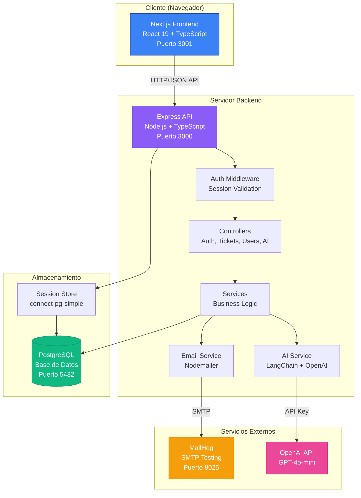
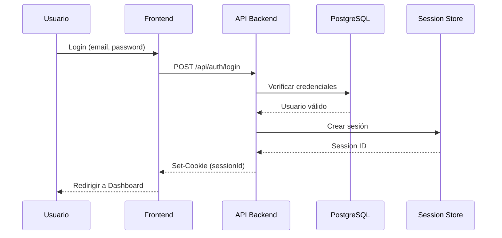
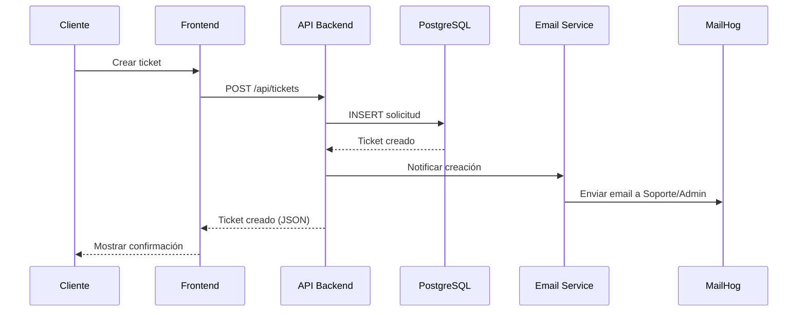
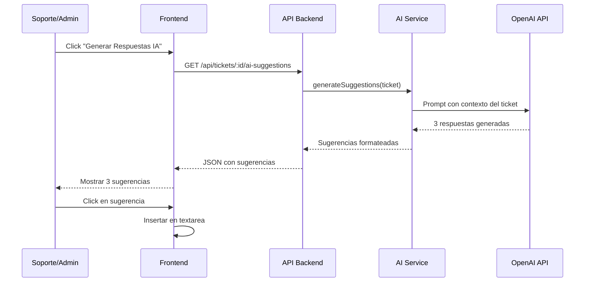

# Arquitectura del Sistema de Tickets de Soporte

## Diagrama de Arquitectura

## Flujo de Autenticación

## Flujo de Creación de Ticket

## Flujo de Sugerencias con IA

## Stack Tecnológico por Capa

### Frontend
- **Framework**: Next.js 15 (App Router)
- **UI Library**: React 19
- **Styling**: Tailwind CSS v4
- **Components**: shadcn/ui
- **Charts**: Recharts
- **State**: React Context API
- **HTTP Client**: Fetch API con credentials

### Backend
- **Runtime**: Node.js 18+
- **Framework**: Express.js
- **Language**: TypeScript
- **Session**: express-session + connect-pg-simple
- **Security**: bcrypt, helmet, cors
- **Email**: nodemailer
- **AI**: LangChain + OpenAI SDK
- **Documentation**: Swagger (swagger-ui-express)

### Database
- **DBMS**: PostgreSQL 12+
- **ORM**: Raw SQL con pg Pool
- **Schema**: 4 tablas principales
  - roles
  - usuarios
  - solicitudes
  - respuestas

### DevOps
- **Containerization**: Docker + Docker Compose
- **Services**: 4 contenedores
  - frontend (Next.js)
  - backend (Express)
  - postgres (PostgreSQL)
  - mailhog (Email testing)

